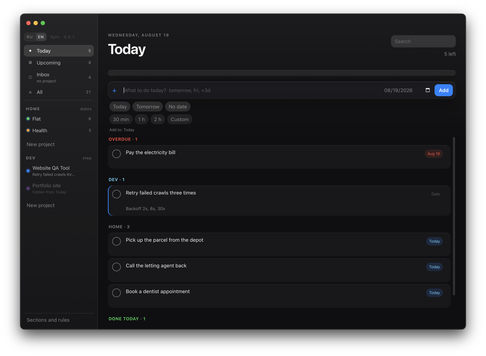
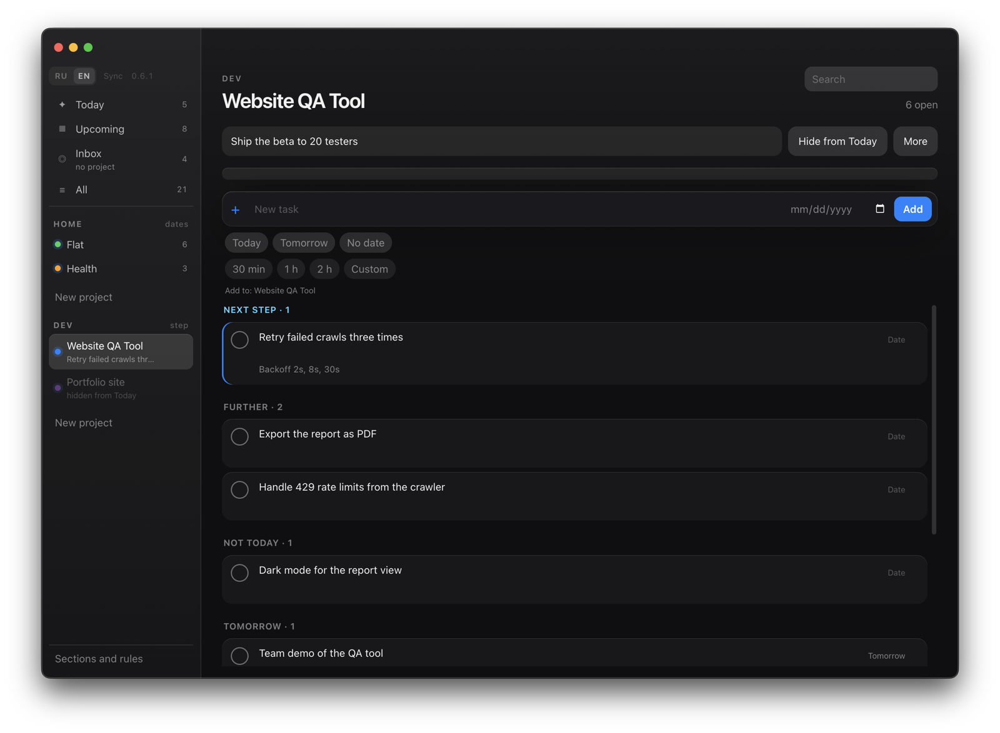
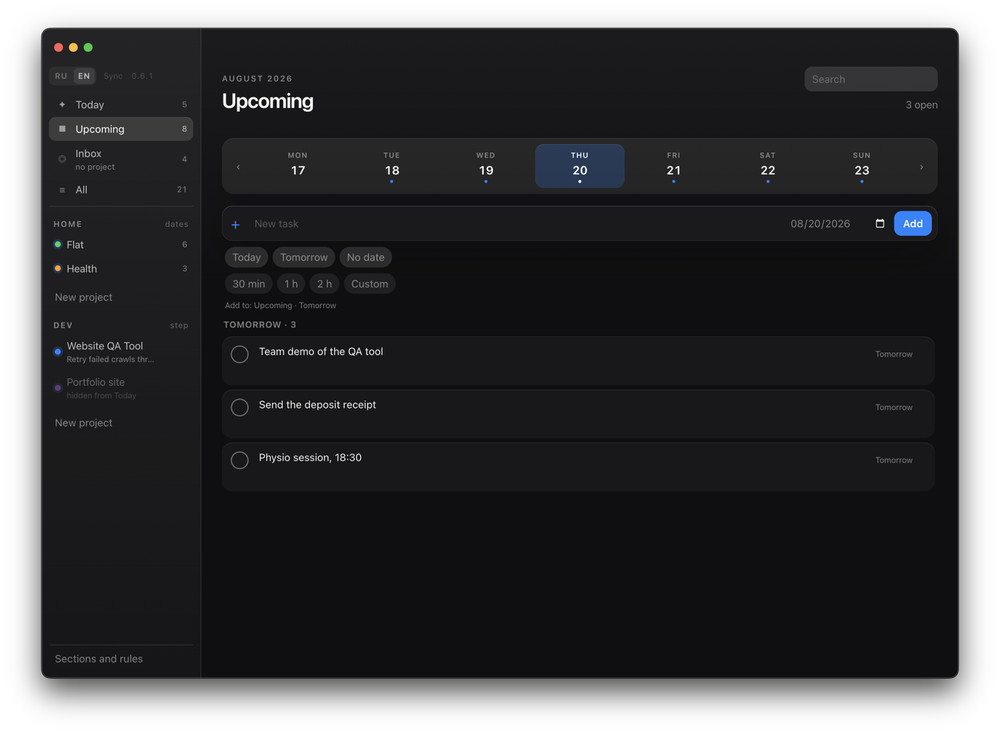
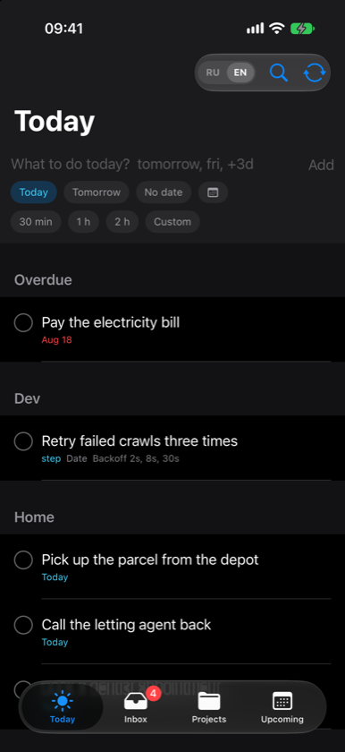
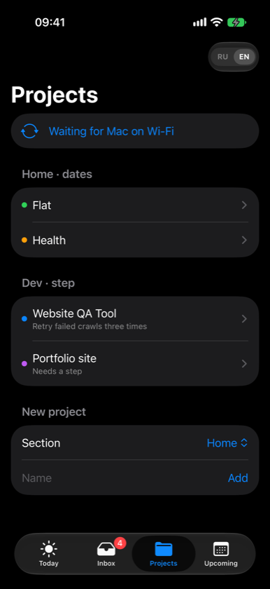
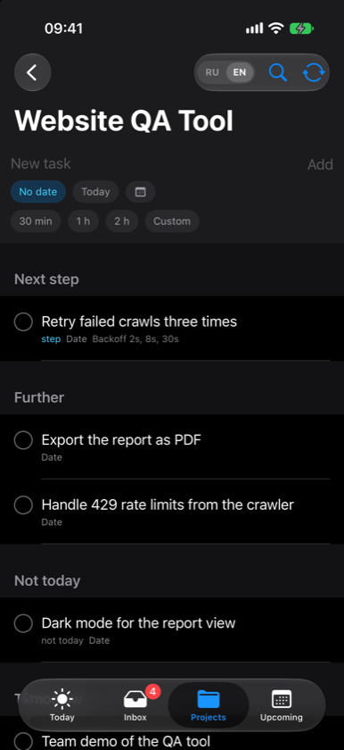

# Task Tracker

A personal task list for Mac and iPhone. No account, no cloud, no subscription. The list is a JSON file on your own machine, and the two apps talk straight to each other over local Wi‑Fi. English by default, with a **RU | EN** switch.



## The idea

Most task apps let Today fill up with everything you ever wrote down. Here each project sits in a **section**, and a section has exactly one rule about what it may push into Today.

- **By date** — a task appears in Today on the day it is due. Suits errands, bills, appointments.
- **One step** — a project contributes a single task to Today: its next step. Suits long builds that would otherwise dump twenty open items into your morning.

Above, `Home` is a by-date section and `Dev` is a one-step section. The QA tool has six open tasks; Today shows one of them.



Pause a project and it leaves Today without losing anything. Mark a single task **not today** to push it aside. Anything with no date and no project waits in Inbox until you decide what it is.

## Typing a date

End a task with `today`, `tomorrow`, `fri`, or `+3d` and it picks up that date — no date picker needed. The week strip marks the days that already have something on them.



## On the iPhone

The same list on the phone. Sections and next steps behave exactly as they do on the Mac, and the two apps find each other over local Wi‑Fi — the banner tells you when the Mac is out of reach.

<table>
<tr>
<td></td>
<td></td>
<td></td>
</tr>
</table>

## Before you install

- The Mac build is **Apple Silicon only**, unsigned and not notarized.
- The iPhone app is not on the App Store. You build it yourself in Xcode and re-run it every 7 days.
- Sync needs both devices awake on the same Wi‑Fi. There is no server, so nothing moves while the Mac is asleep.
- One person, one list. No sharing, no collaboration, no accounts.

## iPhone

There is no App Store or TestFlight build. `TaskTracker-ios.ipa` in [Releases](https://github.com/asxyw/todo-tracker/releases) is a **development** file: it only installs on iPhones already on the original signing team. Anyone else builds from this repo in Xcode and runs onto their own phone.

### Which Xcode

Match Xcode to the iPhone OS. On the phone: **Settings → General → Software Update**. If it says Beta, you need Xcode beta.

- **iOS beta** — download [Xcode beta from Apple Developer](https://developer.apple.com/download/). Sign in with an Apple Account. A paid Developer Program membership is not required to download. Open the `.xip`, then put `Xcode-beta.app` in `/Applications` (or keep it in Downloads). Stable Xcode from the App Store **cannot** install onto a beta iPhone.
- **Release iOS** — install [Xcode from the Mac App Store](https://apps.apple.com/app/xcode/id497799835).

### Build and run on the phone

1. Install the matching Xcode. Open it once and wait until extra components finish installing. In **Xcode → Settings → Accounts**, add your Apple ID.
2. Clone this repository.
3. Open `ios/TaskTracker.xcodeproj` in that Xcode (beta Xcode if the phone is on beta iOS).
4. In the toolbar, choose the **Task Tracker** scheme. Plug the iPhone in with USB, unlock it, tap **Trust**. Select that iPhone as the run destination — not a simulator.
5. Select the **Task Tracker** target → **Signing & Capabilities**. Turn on **Automatically manage signing**. Set **Team** to your Apple ID. If Xcode says the bundle id `com.asxyw.tasktracker.ios` is taken, change it to something unique, for example `com.yourname.tasktracker`.
6. On the iPhone, if asked: **Settings → Privacy & Security → Developer Mode** → On, then restart the phone.
7. In Xcode press **Run** (⌘R). Wait until the app launches on the phone.
8. First launch: if iOS says the developer is not trusted, go to **Settings → General → VPN & Device Management**, tap your Apple ID, **Trust**.

Do not sideload a random IPA from GitHub onto someone else's phone. It will not launch.

### Rebuild every 7 days

A development install from Xcode expires after **7 days**. The icon stays; opening the app fails with an integrity / developer error.

Plug the iPhone in, open the same `ios/TaskTracker.xcodeproj` in the matching Xcode, select the phone, press **Run** again. You do not need a new clone. Re-downloading `TaskTracker-ios.ipa` does not help unless the phone is on the original signing team — and that IPA expires the same way.

### Sync with the Mac app

Lists stay on each device as JSON. Sync is only over local Wi‑Fi, no cloud.

1. Install and open the Mac app (below). Leave it running.
2. Put the Mac and the iPhone on the **same Wi‑Fi**. Guest networks and client isolation block this. Turn off a VPN if it hides the LAN.
3. On the iPhone, when asked, allow **Local Network**. If you missed the prompt: **Settings → Privacy & Security → Local Network → Task Tracker** → On.
4. In the iPhone app, the status should move from “Waiting for Mac on Wi‑Fi” to “Checked with Mac”. If it stays on waiting, tap the sync control in the app.

## Install the Mac app

Builds in [Releases](https://github.com/asxyw/todo-tracker/releases) are **not signed and not notarized**. macOS will warn that the developer cannot be verified. That is expected.

Apple Silicon only (`arm64`).

1. Download `TaskTracker-macos-arm64.zip` from the latest release and unzip it.
2. Right-click `Task Tracker.app` → **Open** → **Open**. Do not double-click the first time.
3. If macOS still blocks it: **System Settings → Privacy & Security** → **Open Anyway**.
4. If it still will not launch, in Terminal:

```bash
xattr -cr "/path/to/Task Tracker.app"
open "/path/to/Task Tracker.app"
```

Tasks are stored at `~/Library/Application Support/Task Tracker/tasks.json`. Nothing is uploaded. Upgrading from an older build moves the list over from the previous folder on first launch.

## Source

This repository is the source: Electron app in `src/`, iPhone app in `ios/`.

Requires Node.js 22+ and macOS.

```bash
npm install
npm start
```

Pack a `.app`:

```bash
npm run pack
```

## License

MIT. Author: [asxyw](https://github.com/asxyw)
